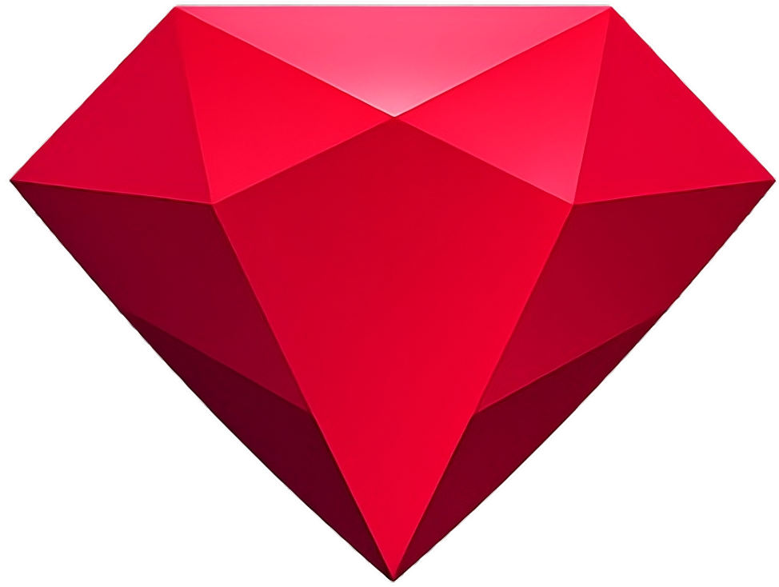

   

<h1 align="center">Ruby</h1>

A lightweight Minecraft Fabric utility client built for precision and performance.

  
  
  
   
  
  

---

## Overview

Ruby is a streamlined Minecraft utility client focused on clean architecture and practical functionality.
It is designed to avoid unnecessary plugin bloat and feature sprawl, keeping the core tight and efficient.

## Building

- Clone the repository
- Run `./gradlew build`
- Compiled artifacts will be located in `build/libs/`

## Installation

1. Install Fabric Loader for your Minecraft version
2. Place the built `.jar` file into your `mods` folder
3. Launch Minecraft

## Contributing

Pull requests are welcome as long as they follow these principles:

- Maintain clean, readable code
- Match the project’s existing structure and style
- Avoid unnecessary abstraction
- Prioritize performance and clarity

If you are adding new modules, ensure they provide meaningful utility and align with the project philosophy.

## Issues

Bug reports and suggestions should be submitted through the GitHub issue tracker.
Provide detailed information including Minecraft version, Fabric version, and steps to reproduce.

## License

This project is licensed under the GNU General Public License v3.0.

If you use any code from this project:

- Your modified work must remain open source
- Proper credit must be given
- The same license must be applied
